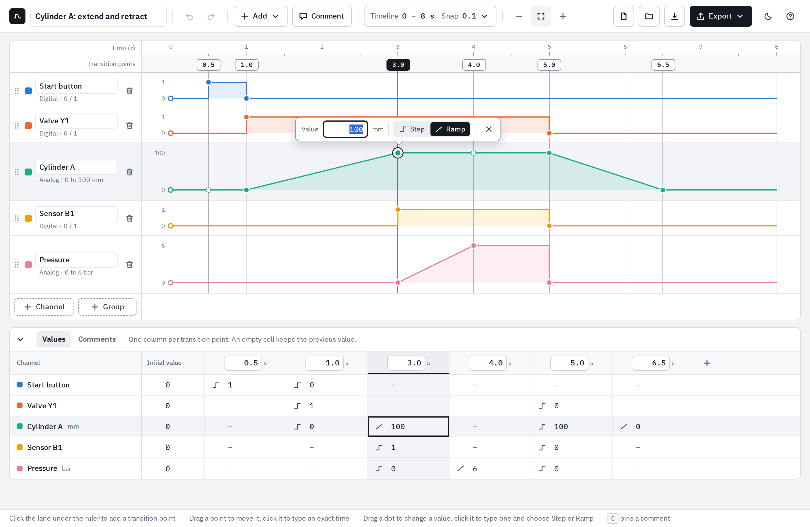
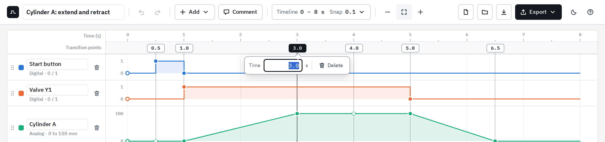
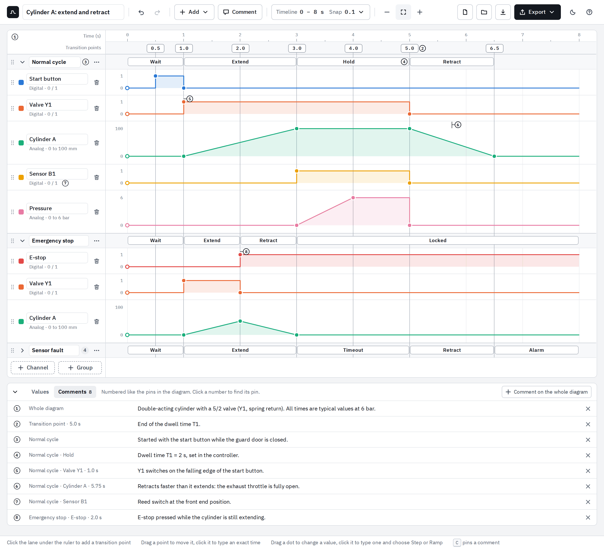
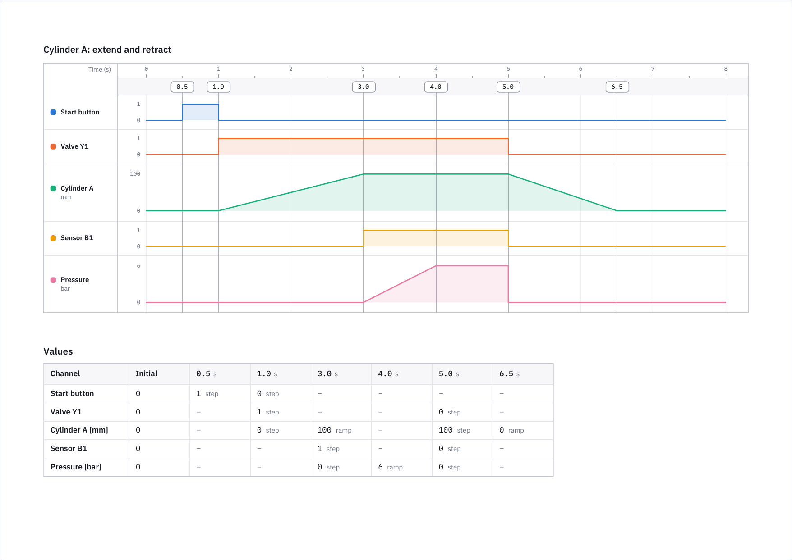

# TimingDiagram

An editor for timing diagrams that runs in the web browser, on Linux and Windows
alike. The whole application is one HTML file: nothing to install, works
offline, and your diagrams never leave your computer.



- Channels stacked vertically on one shared time axis
- Transition points you can drag, or set to an exact time
- A value per point and channel, each reached by a **step** or by a gradual
  **ramp**, so digital and analog signals live in one diagram
- **Groups** with a title, so that several states of a machine fit into one
  diagram, and **phases** that name stretches of time inside a group
- **Comments** pinned to any place in the diagram
- A table that shows and edits every number
- Export to **Excel**, **PDF** and **HTML**, plus PNG and SVG pictures
- Undo for everything, light and dark colours

## Getting it

**Ready to use:** download `TimingDiagram.html` from the
[latest release](../../releases/latest) and open it in Firefox, Chrome or Edge.
Double-click is enough.

**Or build it yourself** (needs [Node.js](https://nodejs.org) 20.19 or newer):

```sh
npm install
npm run build        # writes dist/index.html, the complete application
```

## Using it

The editor starts with a small example. **New** in the toolbar gives you an
empty diagram, and the **?** button shows this guide inside the app.

### Channels

| To … | do this |
|---|---|
| add a channel | **+ Channel** under the lanes, or **Add** in the toolbar, then choose *Digital* (two levels, 0 and 1) or *Analog* (any value, with unit and range) |
| rename it | click the name and type |
| change type, colour, unit or range | click the line under the name (e.g. *Analog · 0 to 100 mm*) |
| reorder | drag the grip at the left edge of the lane |
| remove it | the bin at the right of the name |

### Transition points

Transition points belong to the timeline, not to a single channel: a point is
one vertical line through all lanes.

| To … | do this |
|---|---|
| add a point | click the lane under the ruler, at the time you want |
| move it | drag it. It snaps to a grid; hold **Alt** to place it freely, **Shift** to push all later points along |
| set an exact time | click the point and type the time |
| delete it | click the point, then **Delete** |



Unit, range and snap grid of the time axis are behind the **Timeline** button.

### Values

Where a point crosses a channel, the channel can get a value. Move the pointer
over a lane and every crossing shows a dot.

| To … | do this |
|---|---|
| set a value | drag the dot up or down, or click it and type the value |
| flip a digital channel | click the crossing |
| put a transition anywhere | double-click in the lane; a new point is created if none is there |
| choose step or ramp | click the dot, then **Step** or **Ramp** |
| remove a value | click the dot, then **×**. The channel then does not change at that point |

**Step** keeps the previous value up to the point and jumps there.
**Ramp** changes in a straight line from the channel's previous value. When you
make a value a ramp, the channel's level is fixed at the point before it, so the
ramp covers exactly the interval from the previous point to this one. Remove
that fixed value if the ramp should start further back.

Every channel also has an **initial value** at the start of the timeline (the
ring at the left edge).

The **Values** tab under the diagram shows the same numbers and edits them
too: type into a cell, empty a cell to remove its value, click the small icon to
switch between step and ramp.

### Groups

A group is a titled block of channels, for example one per state of the
machine: the normal cycle, an emergency stop, a fault. All groups share the one
timeline and its transition points, so what happens at the same time lines up
across the groups.



| To … | do this |
|---|---|
| add a group | **+ Group** under the lanes, or **Add ▸ Group** in the toolbar. The first group takes the channels that are already there; every further group starts empty |
| name it | click the title and type |
| add a channel to it | **⋯** in the bar of the group. **+ Channel** under the lanes adds to the last group |
| move a channel into another group | drag it by its grip across the bar of the group, or use the arrow keys on the grip |
| reorder groups | drag the grip of the group |
| fold a group away | the arrow left of the title. The bar and its phases stay visible |
| make a second state from the first | **⋯ ▸ Duplicate group**: the same channels, values and phases under a new title |
| remove a group | **⋯ ▸ Remove group, keep channels** (they move into the neighbouring group), or **⋯ ▸ Delete group** (with its channels) |

Once a diagram has groups, every channel is in one of them. A diagram without
groups works as before. Folding is a way of looking at the diagram: the browser
remembers it, the project file does not, and exports always show every group in
full.

### Phases

A phase is a titled stretch of time inside one group, e.g. *Wait*, *Extend*,
*Hold*, *Retract*. It is drawn in the bar of its group.

| To … | do this |
|---|---|
| add a phase | click in the bar of the group: the phase fills the free stretch between the two transition points around the click. Or drag from one time to another. Then type its title |
| rename it, set exact times | click the phase, then type the title, *from* and *to* |
| move an end | drag it. It snaps to transition points; hold **Alt** to place it freely |
| delete it | click the phase, then **Delete** |

An end that sits on a transition point holds on to it: move the point and the
phase follows. Deleting the point leaves the phase where it is. The phases of a
group lie side by side; one cannot be drawn across another.

### Comments

A comment is a numbered pin with a text. The numbers are given automatically,
from top to bottom and from left to right.

| To … | do this |
|---|---|
| add a comment | **Comment** in the toolbar or the **C** key, then click where it belongs. Type the text, **Enter** (Shift+Enter for a new line) |
| comment on a value, a point or a phase from the keyboard | give it the focus, press **C** |
| read it | move the pointer over the pin, or look in the **Comments** tab under the diagram |
| change it | click the pin, or type in the Comments tab |
| move it | drag the pin |
| find its pin | click its number in the Comments tab |
| delete it | click the pin, then the bin; or **×** in the Comments tab; or empty its text |

A comment can be on a spot of a channel (a channel and a time), on a transition
point, on a phase, or next to the name of a channel, a group or the whole
diagram. A pin dropped near a transition point snaps to it and then moves with
it. A comment lives as long as what it is about: deleting a channel, a group or
a phase deletes its comments too.

### Saving and exporting

**Save** writes the diagram as a `.timing.json` project file; **Open** reads it
back (or drop the file on the window). The editor also keeps the current
diagram in the browser, so closing the tab loses nothing.

The **Export** menu writes:

| Format | Contents |
|---|---|
| Excel workbook (`.xlsx`) | a picture of the diagram, the values with their transitions (one row per point, the group named above its channels), and a *Plot data* sheet that draws the exact waveforms as an XY chart. Phases and comments are listed on sheets of their own |
| PDF document (`.pdf`) | the diagram as vector graphics, the values table, the phases and the comments, on A4 or A3 landscape. A long diagram continues on further pages, breaking between lanes. *Exact size* gives a page that is just the picture |
| Web page (`.html`) | one standalone page with the picture, the values, the phases and the comments. Moving the pointer over the picture shows the time, all values and the phase each group is in. The page can be opened in the editor again |
| Picture (`.png`, `.svg`) | for documents and slides, with the comments listed under the drawing |



A view that you zoomed by hand is exported at that zoom; the fitted view is
exported at a standard width. *Comments: Hide* in the Export menu gives a
drawing without pins and without the list.

Project files that use groups, phases or comments have format version 2.
Version 1.0 of the editor does not open them, and says so; files written by
version 1.0 open as before.

### Keyboard

| Keys | Action |
|---|---|
| Ctrl+Z / Ctrl+Y | undo / redo |
| Ctrl+S / Ctrl+O | save / open a project file |
| ← → | move the selected transition point by one grid step (Shift: ten) |
| ↑ ↓ | change the selected value (Shift: ten steps) |
| S / R | make the selected value a step / a ramp |
| C | pin a comment: to what has the focus, or with the next click |
| Delete | delete the selected point, value, phase or comment |
| Ctrl + mouse wheel | zoom the timeline |

## Working on the code

```sh
npm run dev          # development server with live reload
npm test             # unit tests (data model, exports)
npm run test:e2e     # builds, then drives the real app in Chromium and Firefox
npm run typecheck
```

The end-to-end tests need the test browsers once: `npx playwright install chromium firefox`.
`e2e/requirements.spec.ts` has one test per requirement of [`Ideas.txt`](Ideas.txt);
groups, phases, comments and their exports have a file each.

| Folder | Contents |
|---|---|
| `src/model` | the diagram as data, and every way to change it (pure functions, no UI) |
| `src/render` | geometry and the SVG drawing, shared by screen and exports |
| `src/state` | the editor's state with undo history |
| `src/ui` | the editor: toolbar, lanes, groups, phases, comments, panels, values table |
| `src/export` | Excel, PDF, HTML, PNG and SVG |
| `docs` | the plans and mockups the editor was built from: [version 1.0](docs/PLAN.md), and [groups, phases and comments](docs/PLAN-groups-comments.md) |

Built with TypeScript, React and Vite. Excel files are written by ExcelJS, PDF by
jsPDF and svg2pdf.js. The bundled typeface is IBM Plex (SIL Open Font License,
see `src/assets/fonts/LICENSE-IBM-Plex.txt`).
