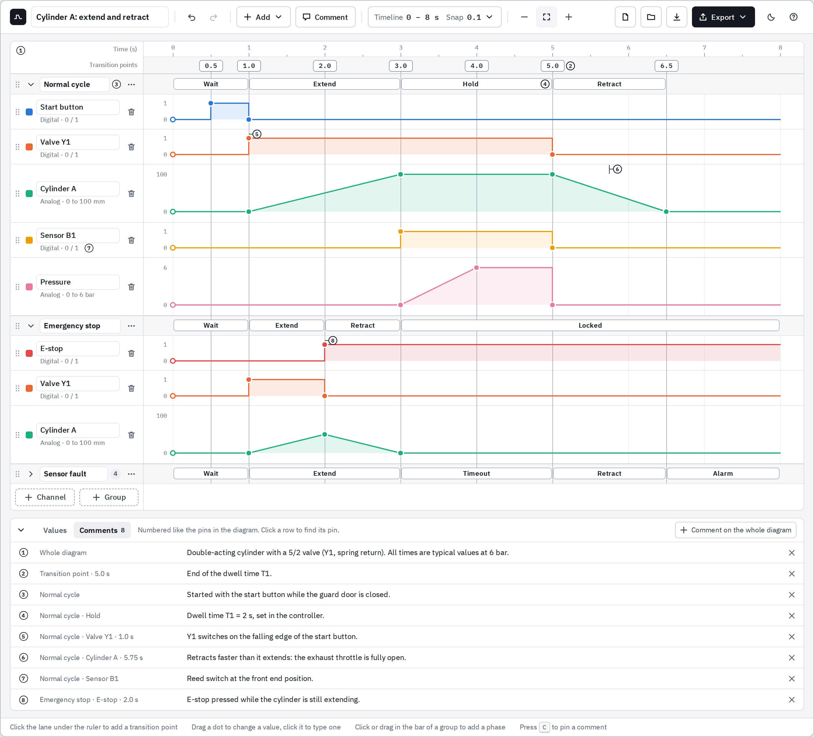
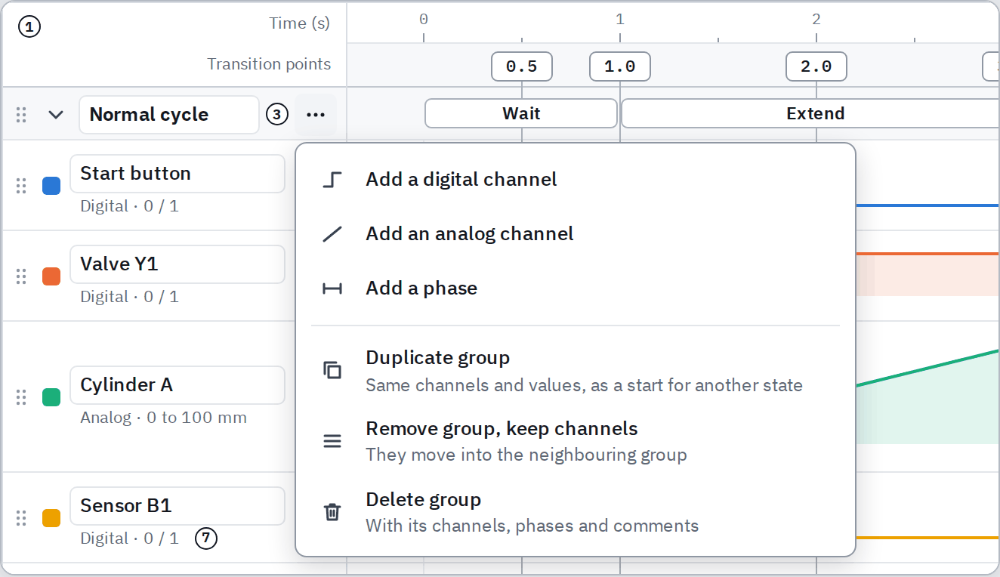
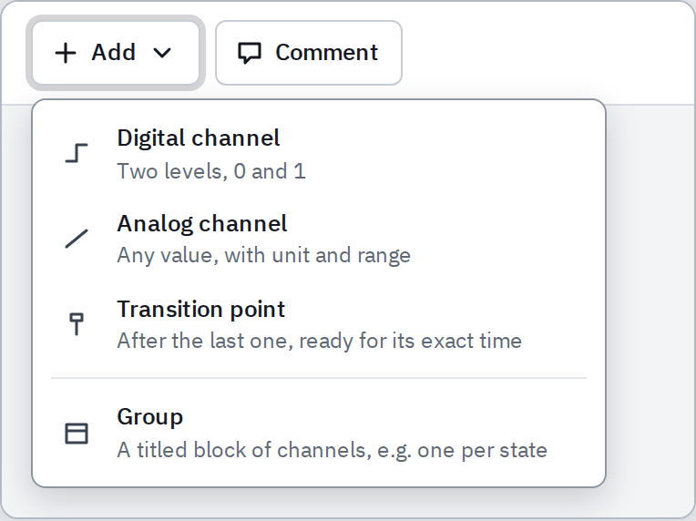
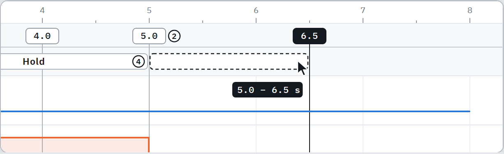
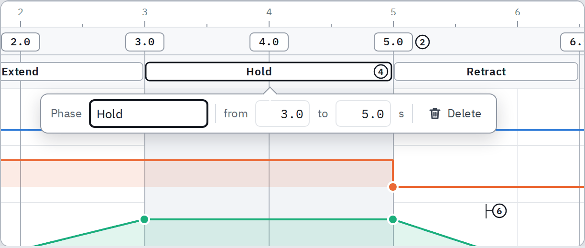
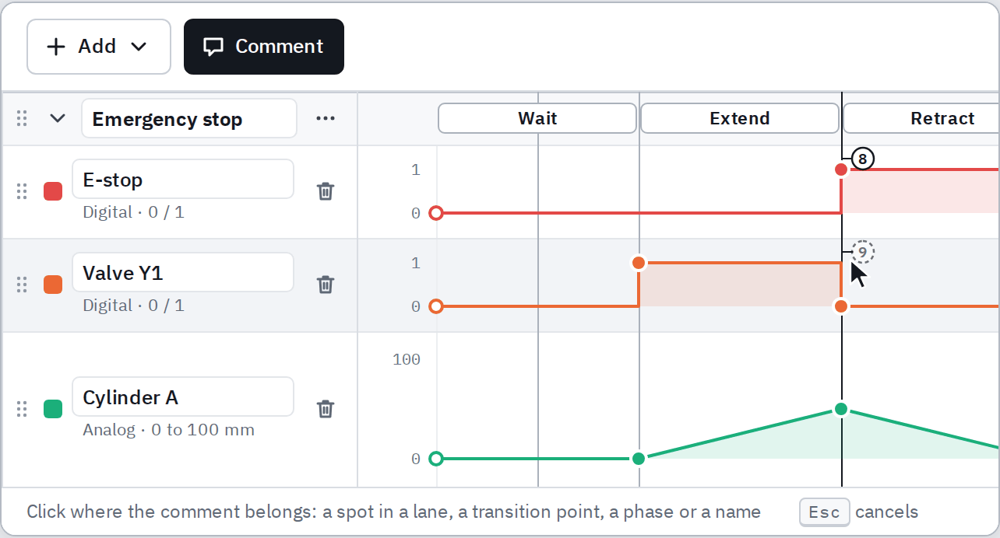
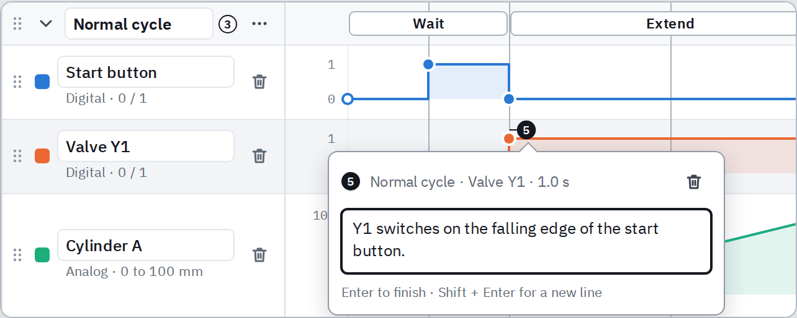
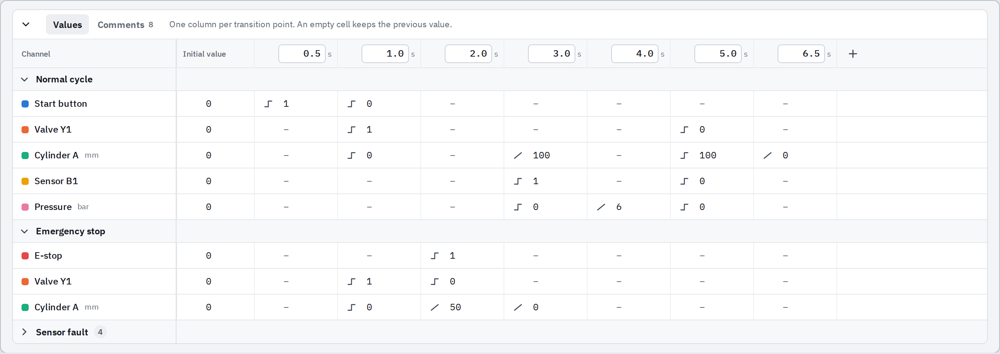
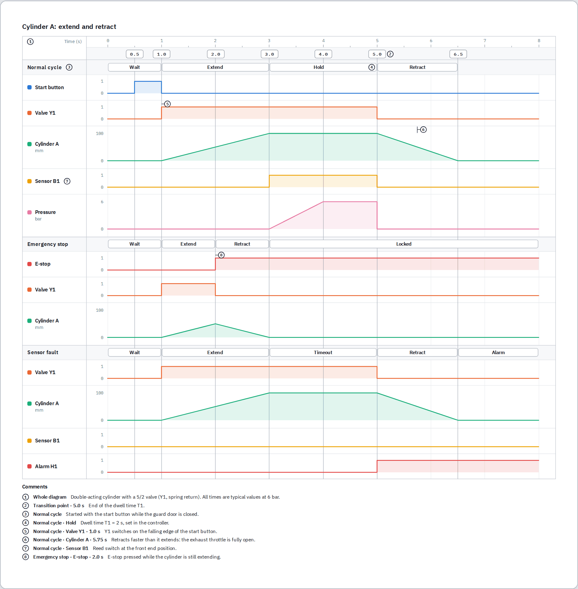

# Groups, phases and comments – Plan

Status: **proposal, nothing is built yet.** The decisions that need your OK are in section 9.
Follows the [first plan](PLAN.md) (version 1.0, built).
Mockup: [`mockup-groups-comments/index.html`](mockup-groups-comments/index.html) (open it in a browser). Its pictures are shown below.
They are drawn with the editor's own drawing code and style sheet, so this is very close to how it will look.



## 1. What gets added

Asked for on 2026-10-06: groups with a title, so that different states can be
described in one timing diagram, and comments. Clarified the same day: there
are two kinds of group, the small one inside the big one.

| | What it is | Example |
|---|---|---|
| **Group** | A titled block of channels. All groups share the one timeline and its transition points. | *Normal cycle*, *Emergency stop* |
| **Phase** | A titled stretch of time inside one group. | *Wait*, *Extend*, *Hold*, *Retract* |
| **Comment** | A numbered pin with a text, attached to a place in the diagram. | *Y1 switches on the falling edge of the start button.* |

"Phase" is my word for the small groups. It is only a label in the editor and
easy to change (section 9).

A diagram without groups looks and works exactly as it does today. Comments
work with or without groups; phases need a group.

## 2. Groups



| To … | do this |
|---|---|
| add a group | **Add ▸ Group** in the toolbar, or **+ Group** under the lanes. The first group takes the channels that are already there; every further group starts empty |
| name it | click the title and type |
| add a channel to it | **⋯** in the bar of the group, then *Add a digital channel* or *Add an analog channel*. **+ Channel** under the lanes adds to the last group |
| move a channel into another group | drag it by its grip across the bar of the group, or use the arrow keys on the grip |
| reorder groups | drag the grip of the group |
| fold a group away | the arrow left of the title. The bar and its phases stay visible, with the number of hidden channels |
| make a second state from the first | **⋯ ▸ Duplicate group**: the same channels, values and phases under a new title |
| remove a group | **⋯ ▸ Remove group, keep channels** (they move into the neighbouring group), or **⋯ ▸ Delete group** (with its channels) |

Rules:

- **Once a diagram has groups, every channel is in exactly one of them.** There
  are no loose channels between groups. Signals that belong to all states go
  into a group of their own, e.g. *Common*.
- **Transition points stay what they are:** one line through all groups. A
  point that one group needs for an edge also shows in the other groups, and
  channels in different groups that use the same point stay aligned.
- **Folding is a way of looking at the diagram, not part of it.** The browser
  remembers it, the project file does not, and exports always show every group
  in full.

The toolbar has no room for more buttons: at a window width of 1366 px only
38 px are free. So **+ Channel** and **+ Point** become one **Add** menu, and
**Comment** takes the place that frees up.



## 3. Phases



| To … | do this |
|---|---|
| add a phase | click in the bar of the group: the phase fills the free stretch between the two transition points around the click. Or drag from one time to another. Or **⋯ ▸ Add a phase** |
| name it | type the title right after adding it |
| rename it, set exact times | click the phase, then type the title, *from* and *to* |
| move an end | drag it. It snaps to transition points; hold **Alt** to place it freely |
| delete it | click the phase, then **Delete** (button or key) |



Rules:

- **An end that sits on a transition point holds on to it.** Move the point, by
  dragging or by typing its exact time, and the phase follows. An end that was
  placed freely stays at its time.
- **The phases of a group lie side by side in one row.** A phase cannot be
  drawn across another one. Gaps between phases are fine.
- **Deleting a transition point does not delete phases.** Their ends stay at
  the time the point had.

## 4. Comments



A comment can be put on:

| Place | Where its pin shows | In the first picture |
|---|---|---|
| a spot of a channel (a channel and a time) | at the top of the lane, at that time | 5, 6, 8 |
| a transition point, for the whole diagram | next to the point in the ruler | 2 |
| a phase | inside the phase | 4 |
| a channel, a group or the diagram as a whole | next to the name | 7, 3, 1 |

| To … | do this |
|---|---|
| add a comment | **Comment** in the toolbar or the **C** key, then click the place. Type the text, **Enter** |
| comment on the whole diagram | **+ Comment on the whole diagram** in the Comments tab |
| read a comment | move the pointer over its pin, or look in the Comments tab |
| edit it | click the pin, or type in the Comments tab |
| move it | drag the pin |
| find its pin | click its row in the Comments tab. The diagram scrolls there and unfolds the group if needed |
| delete it | click the pin, then the bin or **Delete**; or **×** in the Comments tab |



Rules:

- **Numbers are given automatically,** from top to bottom and from left to
  right, and follow when something is added or moved.
- **A pin dropped near a transition point snaps to it and then moves with it,**
  like the end of a phase. Dropped anywhere else it stays at its time.
- **A comment lives as long as the thing it is about.** Deleting a channel, a
  group or a phase deletes its comments too. Undo brings everything back.

Why pins with a list, and not text written into the drawing: a text of any
length fits, nothing covers a waveform, and it prints cleanly.

## 5. Table, files and exports



| Part | Change |
|---|---|
| Table under the diagram | Two tabs. **Values** as today, with a heading row per group that folds like in the diagram. **Comments** lists all comments (first picture) |
| Project file | Format version 2, with groups, phases and comments. Files from version 1.0 open unchanged. Version 1.0 of the editor refuses a new file with a clear message instead of silently losing the new parts |
| Picture (PNG, SVG) | Group bars, phases and pins are part of the drawing; the comments are listed under it |
| PDF | The drawing, the values table with a heading row per group, a table of the phases, the list of comments. A long diagram breaks between lanes, and a group that continues on the next page repeats its bar |
| Excel | *Values*: a row with the group above the channel names. *Plot data*: the group in the column title, because two groups often hold channels of the same name. New sheets *Phases* (group, phase, from, to, duration) and *Comments* (number, place, time, text) |
| Web page | Drawing, values, phases and comments. The readout under the pointer also names the phase each group is in |

The Export menu gets one switch, *Comments: show / hide*, for a drawing
without pins.



## 6. How it is modelled

What a project file gains (shortened):

```json
{
  "kind": "timing-diagram",
  "version": 2,
  "points": [{ "id": "p2", "time": 1 }, { "id": "p3", "time": 3 }],
  "groups": [
    {
      "id": "g1",
      "title": "Normal cycle",
      "phases": [{ "id": "h2", "title": "Extend", "from": { "point": "p2" }, "to": { "point": "p3" } }]
    }
  ],
  "channels": [{ "id": "c2", "group": "g1", "name": "Valve Y1" }],
  "comments": [
    {
      "id": "n5",
      "text": "Y1 switches on the falling edge of the start button.",
      "on": { "kind": "channel", "channel": "c2", "at": { "point": "p2" } }
    }
  ]
}
```

- **A moment is either a transition point or a time.** `{ "point": "p2" }`
  follows the point, `{ "time": 5.75 }` stays put. The ends of a phase and the
  pin of a comment both use this, so they behave the same way.
- **Points remain in charge of time.** Deleting a point turns the moments on it
  into plain times. Shift-dragging a point, which pushes all later points
  along, pushes later free moments along too. The time range cannot be made so
  short that it hides a phase or a pin.
- **Channels stay one list from top to bottom;** each channel names its group.
  The list is kept in the order of the groups, so the table and the exports get
  the channels in the order they are drawn without knowing about groups.
- **A comment says what it is on:** the diagram, a group, a phase or a channel,
  for diagram and channel optionally with a moment.
- **Not stored:** the numbers of the comments (they come from the positions),
  and what is only a way of looking: folded groups, the open tab, the comment
  tool. None of these is an undo step.

## 7. What changes in the code

| Folder | Change |
|---|---|
| `src/model` | `types.ts`: `Group`, `Phase`, `Anchor`, `Comment`, and `Channel.group`. New `groups.ts`, `phases.ts`, `comments.ts`: pure functions like the ones in `doc.ts`. `doc.ts`: the three rules about points in section 6. `serialize.ts`: writes version 2, reads 1 and 2 |
| `src/render` | `layout.ts`: the bars of the groups between the lanes, folded groups, the places of phases and pins. `parts.tsx`: group bar, phase, pin. Shared by screen and exports as before |
| `src/state` | A phase or a comment can be selected; the comment tool; folded groups and the open tab as view state |
| `src/ui` | `GroupHeader`, panels for a phase and for a comment, `CommentsPanel`, the tabs, the Add menu. `Stage.tsx` has 518 lines today and is split into ruler, lanes and panels before it grows |
| `src/export` | The picture draws groups, phases, pins and the comment list. PDF pages break by group. New tables and sheets. Comment texts are wrapped with the real letter widths of the bundled font (`scripts/build-fonts.mjs` writes a small width table) |
| `README.md`, help panel | Guide for groups, phases and comments, new screenshots, and a second example diagram that uses them. The start-up example stays as it is |

## 8. Steps and tests

Each step ends with all tests passing and is one commit.

1. **Model and file format** – groups, phases, comments, moments, version 2.
2. **Drawing** – layout with group bars; phases and pins; the exported picture.
3. **Groups in the editor** – bar, add, rename, reorder, fold, menu, channels
   across groups, heading rows in the Values tab, Add menu.
4. **Phases in the editor** – click and drag in the bar, ends, exact times.
5. **Comments in the editor** – tool, pins, text, dragging, Comments tab.
6. **Exports** – PDF, Excel, web page, comment list in pictures.
7. **Finish** – browser tests, user guide, help, example, version 1.1.0.

Tests:

- **Logic (Vitest):** every new function of the model; a file of version 1
  opens as a diagram without groups; version 2 survives saving and opening;
  damaged files are repaired; a phase and a pin follow a moved point and stay
  put when the point is deleted; comment numbers follow the reading order;
  pictures, tables and sheets contain groups, phases and comments.
- **In the browser (Playwright, Chromium and Firefox):** one test each for
  groups, phases and comments that goes through the tables of sections 2 to 4,
  and one for the exports. The nine tests for the requirements of version 1.0
  stay unchanged and keep passing, which shows that a diagram without groups
  behaves as before.

## 9. Decisions to confirm

My choice is the first sentence of each item; say so if you want the other one.

1. **The small groups are called "phase".** Other words that would fit:
   *section*, *state*, *step*.
2. **Once there are groups, every channel is in one, and the first group takes
   the existing channels.** The alternative, loose channels above the first
   group, adds rules without adding anything a group *Common* cannot do.
3. **Comments are numbered pins with a list.** Short labels written directly
   into the drawing could be added later on top of this.
4. **Folding does not change exports:** they always show everything. The
   alternative is to export exactly what is visible, with a folded group as its
   bar only.
5. **One Add menu instead of the buttons + Channel and + Point.** The
   alternative, four separate buttons, wraps the toolbar onto two lines on
   small screens.
6. **Duplicate group copies channels, values and phases, not comments.**

## 10. Not in this step

Text written directly into the drawing, arrows between transitions, groups
inside groups, phases that span all groups, colours for phases, exporting only
some of the groups, transition points that belong to one group only.
