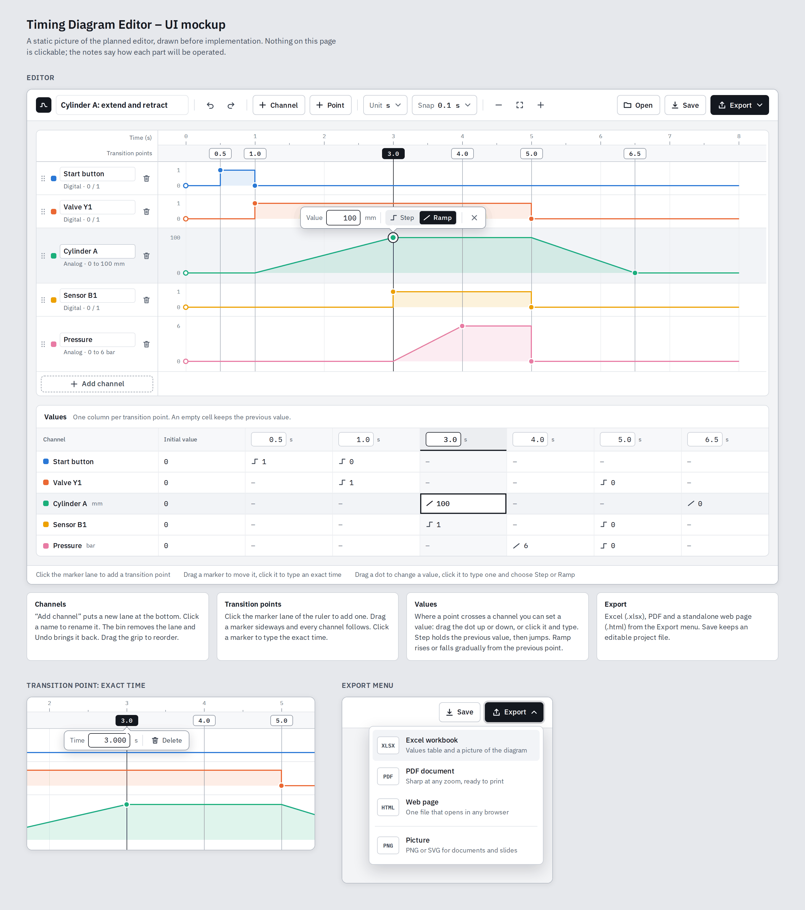

# Timing Diagram Editor – Plan

Status: **approved on 2026-10-06 and built.** Section 8 lists where the result differs from this plan.
Next step, not built yet: [groups, phases and comments](PLAN-groups-comments.md).
Original requirements: [`Ideas.txt`](../Ideas.txt).
Mockup: [`mockup/index.html`](mockup/index.html) (open it in a browser), shown below.

## 1. What gets built

An editor for timing diagrams: channels stacked vertically, one shared time
axis, transition points that can be dragged or typed exactly, a value per point
and channel, and a choice per value between a hard step and a gradual ramp.
Diagrams export to Excel, PDF and HTML.

## 2. Platform: web browser (decided)

A browser application written in TypeScript, delivered as **one self-contained
HTML file**.

| | Browser app (chosen) | C# desktop app (Avalonia) |
|---|---|---|
| Linux + Windows | Same file on both, nothing to compile or install | One build per system |
| Start | Double-click the file, or open a link | Install or unpack, then run |
| Works offline | Yes | Yes |
| Sharing with colleagues | Send one file or a link | They need the right build |
| Export Excel / PDF / HTML | Mature libraries, all in the browser | Possible, more plumbing |
| Later as a desktop program | Can be wrapped (Tauri) without a rewrite | Already is one |

The data never leaves the computer: there is no server, files are read and
written locally.

## 3. How each requirement is met

| # | Requirement | Solution |
|---|---|---|
| 1 | Intuitive | Everything is done on the diagram itself: click to add, drag to move, click to type an exact number. Undo/redo for every action, so nothing needs a confirmation dialog. A small example opens on first start. |
| 2 | Add / remove channels | "Add channel" under the last lane and in the toolbar. A bin icon on each lane. |
| 3 | Editable channel name | Click the name and type. |
| 4 | Channels stacked vertically | One lane per channel. Drag the grip to reorder. |
| 5 | One horizontal timeline | One ruler above all lanes. Unit (s, ms, µs, ns, min or none) and range are adjustable; zoom and fit. |
| 6 | Transition points, movable and exact | Click the marker lane of the ruler to add a point. Drag its marker to move it; it snaps to a grid that can be changed or switched off. Click the marker to type the exact time. Times are also editable in the values table. |
| 7 | A value per point and channel | A dot where a point crosses a channel. Drag it up or down, or click it and type the value. The values table shows every value at once. |
| 8 | Hold the previous value, or change gradually | Every value has a Step / Ramp switch. **Step**: the channel keeps its previous value up to this point, then jumps. **Ramp**: the channel changes linearly from the previous point to this one. Both can be mixed inside one channel. |
| 9 | Export to Excel, PDF, HTML | Export menu: `.xlsx` (values table, chart-ready data and a picture), `.pdf` (vector, A4/A3/fit), `.html` (one standalone page). PNG and SVG pictures come along for free. |

## 4. How the diagram is modelled

- **Transition points belong to the timeline, not to a channel.** A point is one
  vertical line through all lanes. Moving it moves every transition that sits
  on it, so events that belong together stay aligned.
- **A channel does not need a value at every point.** An empty crossing means
  "no change here". A point used by only one channel is perfectly fine.
- **Every channel has an initial value** at the start of the timeline.
- **A value describes how the channel arrives at it**: Step (keep the previous
  value, then jump) or Ramp (straight line from the channel's previous value).
  Making a value a ramp also fixes the channel's level at the point before, so
  the ramp runs "from the previous point to this one" (see section 8).
- **Digital and analog are a convenience, not a restriction.** A digital channel
  snaps to 0/1 and defaults to Step; an analog channel takes any number, has a
  unit and a range, and defaults to Ramp. A cylinder that travels between two
  end positions is simply a channel with ramps.

Example (the diagram the editor starts with):

| Channel | Initial | 0.5 s | 1.0 s | 3.0 s | 4.0 s | 5.0 s | 6.5 s |
|---|---|---|---|---|---|---|---|
| Start button | 0 | step 1 | step 0 | | | | |
| Valve Y1 | 0 | | step 1 | | | step 0 | |
| Cylinder A (mm) | 0 | | step 0 | ramp 100 | | step 100 | ramp 0 |
| Sensor B1 | 0 | | | step 1 | | step 0 | |
| Pressure (bar) | 0 | | | step 0 | ramp 6 | step 0 | |

## 5. Technology

| Part | Choice | Why |
|---|---|---|
| Language / UI | TypeScript, React, Vite | Typed, widely known, fast build |
| Drawing | SVG | Sharp at every zoom, and the same drawing code feeds screen, HTML, PDF and PNG |
| State | One document object with an undo history | Simple, testable, easy to save |
| Excel | ExcelJS | Real `.xlsx` with formatting and an embedded picture |
| PDF | jsPDF + svg2pdf.js | Vector output, text stays selectable |
| Tests | Vitest (logic), Playwright (the real app in a browser) | Every requirement gets an automated check |
| Delivery | Single `index.html` from the build; optional GitHub Pages | Runs from a double-click, offline |

Project file: `*.timing.json` (readable text, versioned). The editor also keeps
the current diagram in the browser so a closed tab loses nothing.

## 6. Steps

1. **Foundation** – project setup, data model, waveform maths, unit tests.
2. **Diagram** – ruler, lanes, channel add / remove / rename / reorder.
3. **Transition points** – add, drag with snapping, exact time entry, delete.
4. **Values** – dots, drag, value popover with Step / Ramp, values table.
5. **Workflow** – undo / redo, save / open, autosave, zoom, keyboard shortcuts.
6. **Export** – HTML, PDF, Excel, PNG / SVG.
7. **Finish** – browser tests for all nine requirements on Firefox and Chromium,
   user guide in the README, release build.

## 7. Not in the first version

Possible later, deliberately left out now to keep the tool small:
text / bus values (e.g. `0x3F`, `IDLE`), cause-and-effect arrows between
transitions, measurement cursors (Δt), import from Excel / CSV, a packaged
desktop program.

## 8. What changed while building

The mockup stays as it was drawn; these are the places where the finished
editor deliberately differs from it or from the plan above.

- **A ramp starts at a value, not at whatever point happens to come before.**
  The first design measured a ramp from the previous point on the timeline.
  That made channels depend on points they do not use: a point added for one
  channel in the middle of another channel's ramp would have shortened that
  ramp. Now a ramp runs from the channel's own previous value. To keep the
  behaviour asked for in requirement 8, making a value a ramp places a value at
  the point before it (the level the channel has there). That value shows as a
  dot at the foot of the ramp and as a "step" entry in the table; removing it
  lets a ramp span several points.
- **"Add channel" asks for the type** (digital or analog) instead of creating a
  digital channel that then has to be converted.
- **New / Open / Save are three buttons** in the toolbar; on narrow windows
  they show icons only. "Unit" and "Snap" share one "Timeline" panel, which
  also holds the range.
- **The PDF contains the values table** as well as the picture, and the
  **HTML page shows time and values under the pointer** and can be opened in
  the editor again.
- **Zoom is anchored** at the pointer (Ctrl + wheel), and labels of points
  that lie close together stack in up to three rows instead of covering each
  other.
